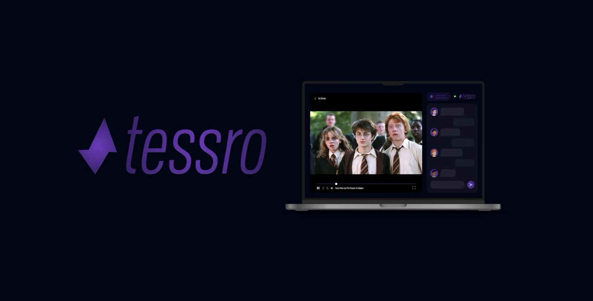

  

<h1 align="center">Tessro</h1>

<strong>Real-time. Real fast. Fully private.</strong>

  
  
  
  
  

---

### **💻 V2.1 Live Now! →** [tessro.com](https://tessro.com/)

---

## 🎥 What is Tessro?

**Tessro** is a blazing-fast real-time synchronized video playback platform that just got even better. Whether you're across the world or across the room, Tessro brings friends and teams together with seamless, **fully private video sessions**.

🚀 You can now choose between two modes:

- 🌀 **Sync Mode** — Everyone picks the same local video file, and Tessro syncs playback across devices.
- 📡 **Stream Mode** — The host selects a file, and others watch the host’s stream in real-time, thanks to **WebRTC**.

**All with:**
- ❌ No uploads  
- 🔐 No accounts  
- 👀 No tracking  
- 🔄 Real-time sync  
- 💬 Live chat  

---

## 💡 The Vision

> *Bring back the joy of watching together — personal, private, and perfectly in sync.*

Tessro is ideal for:
- 🎞️ Movie nights
- 🎓 Online training
- 📽️ Remote film reviews
- 🤝 Connecting with loved ones

---

## Core Features (v2.1)

| Feature                          | Notes                                                             |
|----------------------------------|--------------------------------------------------------------------|
| 🔁 Sync Mode                     | File-based synchronization with hash matching                     |
| 📡 Stream Mode (WebRTC)          | Host streams video to all guests via peer-to-peer                 |
| 🔐 Secure Sessions               | Password-protected, nickname-based login                          |
| 💬 Live Chat                     | Scrollable, with sender info and timestamps                       |
| 👥 Participant List              | Real-time with host/you indicators                                |
| 🧠 Smart Cleanup                 | Host leaving ends session, guests gracefully exit                 |
| 🛡️ Private, Peer-to-Peer         | WebRTC ensures direct connections — **no centralized relaying**   |
| 📱 Mobile-Friendly               | Drawer-based mobile layout with responsive design                 |
| 👨‍💻 Custom Video Player           | Fullscreen mode for guests, better playback and volume control (But can be buggy on mobile) |

---

## 🧐 How It Works

1. 🔧 **Create Session** — As a host, generate a session and choose a file.
2. 🔑 **Invite Others** — Friends join with your session ID and password.
3. 🌀 **Pick Your Mode** — Sync files or just let the host stream.
4. ⏯️ **Watch Together** — Tessro handles syncing, controls, and chat!

---

## 🔒 Privacy First

Tessro:
- Stores **no user data**
- Uses **no uploads**
- Supports **end-to-end WebRTC streaming**
- Has **no trackers, ads, or analytics**

Coming soon: self-hosted TURN fallback for even better firewall/NAT support (currently using free 24h servers on Twilio).

---

## 🔮 Roadmap

| Feature                          | Status      |
|----------------------------------|-------------|
| ✅ Real-time Sync Mode           | Completed   |
| ✅ WebRTC Peer Streaming         | Completed   |
| ✅ Custom Video Player           | Completed   |
| ⏳ Voice Chat                    | In Progress |
| ⏳ Emoji Reactions               | In Progress |
| ⏳ Subtitle Syncing              | Planning    |
| ⏳ Self-hosted TURN server       | Planning    |
| ⏳ Native Mobile App             | Planning    |
| ⏳ Offline LAN-only Mode         | Planning    |
| ⏳ Persistent Accounts (Optional) | Not in Vision, but may integrate on request    |

---

## **👨‍💻 Dev Team**

Just me, actually.

| Name                      | Institution             | ID | GitHub | Followers |
|---------------------------|-------------------------|--  |--------|------|
| **Rajin Khan**            | North South University | 2212708042 |  |  |

---

### ⭐ **Star this repo if you want more cool stuff like this!**

## 🚀 Want to Contribute?

Tessro is open-source, and minimalist. PRs are welcome!

