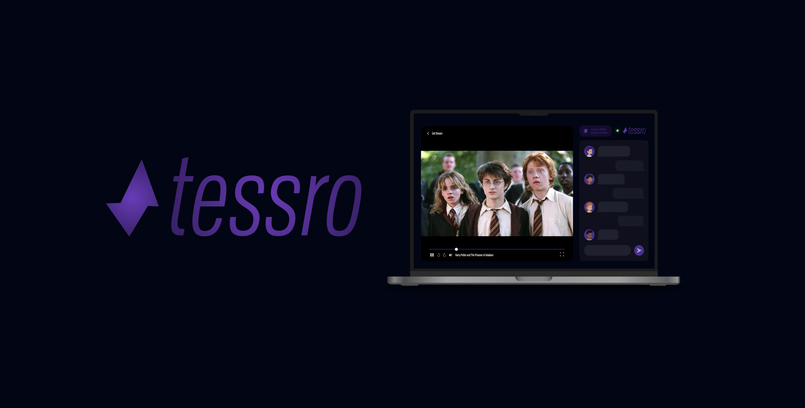

<p align="center">
  
</p>

---
<h1 align="center">Tessro</h1>
<p align="center"><strong>Real-time. Real fast.</strong></p>

<p align="center">
  
  
  
  
  
</p>

<div align="center">

---

## 🎥 What is Tessro?

**Tessro** is a blazing-fast, real-time synchronized video playback platform. It allows friends, teammates, or entire communities to **watch videos together**, no matter where they are — all in **perfect sync**.

Unlike streaming services, Tessro doesn't require users to have a streaming service account, or upload video files. Instead, each participant selects the same local file from their own device (for now), and Tessro handles **synchronized playback** and **real-time chat**.

---

## 💡 The Idea

The concept behind Tessro is simple:
> *Bring the magic of watching movies together back into the digital era — private, personal, and lightning fast.*

Whether it's a long-distance movie night, remote training video, or collaborative film review, Tessro keeps everyone **in sync and connected**.

---

## 🚀 What It Will Be

✅ MVP Features:
- Real-time synchronized playback  
- Local file selection (no uploads)  
- Secure session creation and joining  
- Integrated real-time chat  

🛠️ Upcoming Goals:
- WebRTC peer streaming (no need for same local file)  
- User accounts and persistent sessions  
- Subtitle and buffer-aware synchronization  
- Mobile-optimized and native app versions  

---

## ⚙️ Tentative Tech Stack

### 🌐 Frontend
- **React** + **Vite** – blazing fast builds & dev server  
- **Tailwind CSS** – utility-first styling  
- **React Player** – flexible media player  
- **Socket.IO Client** – real-time sync communication  

### 🖥 Backend
- **Node.js** + **Express** – API + WebSocket gateway  
- **Socket.IO** – event-driven sync and chat  
- **Redis (Serverless)** – fast session storage  
- **Vercel** – frontend + backend deployment  

---

## 🧐 How It Works

1. **Host** selects a local video, creates a session, and shares the session ID.
2. **Guests** select the same local video and join using the ID and password.
3. All playback actions (play, pause, seek) are instantly broadcasted across all users.
4. Everyone experiences a synchronized, shared viewing — plus a chat to stay connected.

---

## 🧪 Dev Setup

</div>

```bash
# Clone the repo
git clone <repository-url>
cd tessro

# Install client dependencies
cd client
npm install
npm run dev

# Install server dependencies
cd ../server
npm install
npm run dev
```

<div align="center">

---

## 🧭 Roadmap

- [ ] Local file-based sync playback
- [ ] Real-time chat
- [ ] Peer-to-peer streaming (WebRTC)
- [ ] Subtitle sync
- [ ] User login + profiles
- [ ] Native mobile app

---

## **👥 Development:**
This project will be developed by:

| Name                      | Institution             | ID | GitHub | Followers |
|---------------------------|-------------------------|--  |--------|------|
| **Rajin Khan**            | North South University | 2212708042 | [](https://github.com/rajin-khan) |  |
---

⭐ Star the repo if you want more projects like this!
